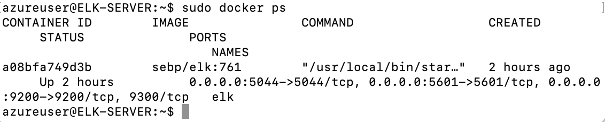

## Automated ELK Stack Deployment

The files in this repository were used to configure the network depicted below.

These files have been tested and used to generate a live ELK deployment on Azure. They can be used to either recreate the entire deployment pictured above. Alternatively, select portions of the playbook file may be used to install only certain pieces of it, such as Filebeat.

 

This document contains the following details:
- Description of the Topology
- Access Policies
- ELK Configuration
  - Beats in Use
  - Machines Being Monitored
- How to Use the Ansible Build

### Description of the Topology

The main purpose of this network is to expose a load-balanced and monitored instance of DVWA, the D*mn Vulnerable Web Application.

Load balancing ensures that the application will be highly available, in addition to restricting inbound access to the network. The off-loading capabilities of a load balancer guards an organization against potential distributed denial-of-service (DDoS) attacks. The benefit of utilizing a jump box, is that it gives the user access from a single node that can be more efficiently monitored, thus reducing the potential attack surface.

Integrating an ELK server allows users to easily monitor the vulnerable VMs for changes to the file systems of the virtual machines on the network and system metrics. Filebeat observes specified log files or locations, gathers log events, and dispatches them to Elasticsearch or Logstash. Metricbeat, on the other hand, captures statistics regarding the other containers operating on the host.

The configuration details of each machine may be found below.
_Note: Use the [Markdown Table Generator](http://www.tablesgenerator.com/markdown_tables) to add/remove values from the table_.

| Name     | Function | IP Address | Operating System |
|----------|----------|------------|------------------|
| Jump Box | Gateway  | 10.0.0.4   | Linux            |
| DVWA 1   |Web server| 10.0.0.5   | Linux            |
| DVWA 2   |Web server| 10.0.0.6   | Linux            |
| ELK      |Monitoring| 10.1.0.4   | Linux            |

### Access Policies

The machines on the internal network are not exposed to the public Internet. 

Only the jump box machine can accept connections from the Internet. Access to this machine is only allowed from the following IP addresses:
Currently, the only whitelisted IP address is my home network (72.141.20.193)

Machines within the network can only be accessed by one another. The ELK machine can only be accessed by the Jump Box, with the Private IP of 10.0.0.4 and the Public IP of 40.112.209.68.

A summary of the access policies in place can be found in the table below.

| Name     | Publicly Accessible | Allowed IP Addresses |
|----------|---------------------|----------------------|
| Jump Box | Yes                 | 72.141.20.193        |
| DVWA 1   | No                  | 10.0.0.1-254         |
| DVWA 2   | No                  | 10.0.0.1-254         |
| ELK      | No                  | 10.0.0.1-254         |

### Elk Configuration

Ansible was used to automate configuration of the ELK machine. No configuration was performed manually, which is advantageous because it a rapid process, and it reduces any potential for human error.

The playbook implements the following tasks:
- Set up a new virtual machine to run ELK.
- Execute commands to check for your Ansible container, locate the container name, and start the container:
  sudo docker ps
  sudo docker container list -a
  sudo docker container start <container name>
- Connect to the Ansible container, as follows:
  sudo docker container start <container name>
- Generate an SSH key from the Ansible container, and configure the VM using that SSH key.
- Create an Ansible playbook. Ensure it contains a command to increase the memory.
- The playbook created should install the following:
  docker.io
  python3-pip
  docker
- Once this is completed, download and run the <sebp/elk:761> container. Ensure the container is started with the following ports:
  - 5601:5601
  - 9200:9200
  - 5044:5044

The following screenshot displays the result of running `docker ps` after successfully configuring the ELK instance.

### Target Machines & Beats
This ELK server is configured to monitor the following machines:
- DVWA 1 (Web-1): 10.0.0.5
- DVWA 2 (Web-2): 10.0.0.g

We have installed the following Beats on these machines:
- Filebeat
- Metricbeat
- Packetbeat

These Beats allow us to collect the following information from each machine:
- Filebeat: Able to detect filesystem changes, through the monitor of specified log files or locations. Used in the compilation of Apache logs.
- Metricbeat: Collects the metrics of the operating system and any running services, such as CPU usage. It is also capable of detecting SSH login attemps, failed sudo privilege escalations, as well as CPU/RAM statistics.
- Packetbeat: Captures network traffic, similar to WireShark.

### Using the Playbook
In order to use the playbook, you will need to have an Ansible control node already configured. Assuming you have such a control node provisioned: 

SSH into the control node and follow the steps below:
- Copy the SSH key file to the Ansible container on your jump box.
- Update the hosts file to include a particular group of machines as well as a remote user.
- Run the playbook, and navigate to docker to check that the installation worked as expected.

